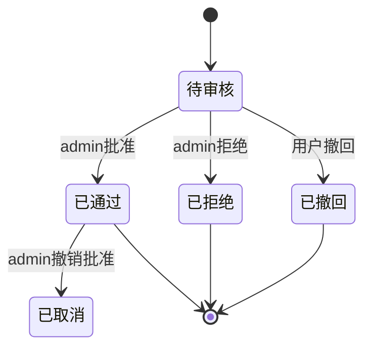
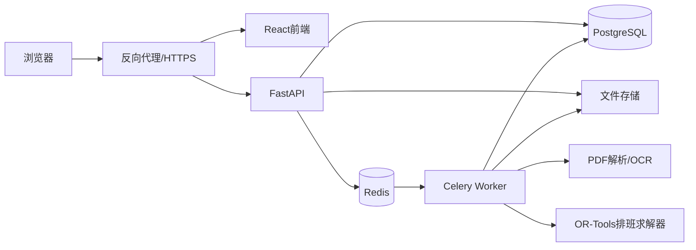

# 党政办公室会议场地排班系统完整实施方案

## 0. 文档定位

本文档用于直接指导需求验证、技术设计、数据库建模、前后端开发、算法实现、测试、部署和验收。执行方应严格遵守本文档中的业务规则，不得自行改变排班人数、时间、工时折算、账号生成、权限边界、课表识别和请假换班流程。

系统暂定名称：**会议场地排班管理系统**

部署形式：服务器部署，浏览器访问。

主要用户：

- `admin`：人员导入、场地管理、任务管理、自动排班、拖拽调整、审核、统计和系统配置。
- `普通用户`：查看本人及公开排班、上传课表、提交不可值班时间、请假、换班、查看个人统计。

本期明确不建设：

- 工资金额计算。
- 短信、企业微信、微信公众号等外部通知。
- 签到、签退、定位考勤。
- 普通用户移动端拖拽排班。
- 银行卡号、身份证号、困难等级参与排班算法。
- 未到岗记录影响后续自动排班权重。

---

# 1. 建设目标

系统需要解决五类核心问题：

1. 将固定场地班次与临时会议任务统一管理。
2. 读取课程表并转换成具体日期和时间的不可值班区间。
3. 在人员可用、无时间冲突和个性化约束的前提下，按月均衡统计工时。
4. 允许admin在电脑网页中自由拖拽人员和任务，并对冲突执行明确校验。
5. 支持普通用户通过手机网页完成查看排班、不可用时间申报、请假和换班。

系统应保存完整历史记录。场地、人员、班次和任务的删除均应采用逻辑停用或归档，避免历史排班和工时统计失去依据。

---

# 2. 已确定业务规则

## 2.1 场地

初始预置三个场地：

1. 黄楼
2. 蓝厅
3. 图书馆报告厅

场地与场地面板均支持增、查、改、停用。已经产生历史排班的场地不得物理删除。

## 2.2 黄楼班次

黄楼每天生成六个固定班次：

| 序号 | 实际时间 | 统计工时 |
|---|---|---:|
| 1 | 08:00—10:00 | 2.0小时 |
| 2 | 10:00—12:00 | 2.0小时 |
| 3 | 12:00—14:00 | 2.0小时 |
| 4 | 14:00—16:00 | 2.0小时 |
| 5 | 16:00—17:30 | 2.0小时 |
| 6 | 17:30—19:00 | 2.0小时 |

人员需求：

- 普通工作日：每班2人。
- 周六、周日：每班1人。
- 法定节假日：每班1人。
- 法定调休工作日：每班2人。
- 特殊日期可由admin覆盖为工作日规则、周末规则、停班或自定义人数。
- 寒暑假期间执行假期规则：默认每天仅保留一个班次、每班1人，详见4.8。

黄楼统计工时直接采用固定值，不参与0.5小时向上取整。

## 2.3 蓝厅与图书馆报告厅

蓝厅与图书馆报告厅仅在存在预约或临时任务时安排人员。

默认规则：

- 默认2人。
- 最低1人。
- admin可对单个任务修改需求人数。
- 允许当天临时创建任务。
- 允许任务跨越多个黄楼班次。
- 同一场地的两个任务在完整值班时间范围内不得重叠。
- 默认提前到岗30分钟。
- 默认收尾时间30分钟。
- admin可对单个任务修改提前到岗分钟数和收尾分钟数。

完整值班时间：

```text
值班开始时间 = 预约开始时间 - 提前到岗时间
值班结束时间 = 预约结束时间 + 收尾时间
```

工时按照完整值班时间计算，再应用倍率规则和0.5小时向上取整。

## 2.4 时间冲突

以下规则属于不可自动违反的强制约束：

- 同一人员在同一时间不能出现在两个场地。
- 同一人员不能同时承担同一场地的两个任务。
- 蓝厅和图书馆报告厅同一场地不能同时存在两个任务。
- 自动排班不得安排到课程时间、审核通过的不可值班时间或admin设定的强制禁排时间。
- admin手动安排可以越过课程冲突、个人不可值班时间和部分个人限制，但必须填写强制安排原因。
- admin手动安排仍然不得制造同一人员的时间重叠。

## 2.5 工时

系统保存以下两套工时：

### 2.5.1 排班平衡工时

用于自动排班公平性计算。

- 正常排班：计入。
- 请假审核通过并移出班次：原人员不计入，补位人员计入。
- 换班审核通过：最终承担人员计入。
- 未到岗：原排班人员仍计入排班平衡工时，保证未到岗不会使其在后续自动排班中获得更低工时权重。
- 任务取消：不计入。
- 手动工时调整：只有admin明确勾选“影响排班平衡”时才影响。

### 2.5.2 实际完成工时

用于月度统计和外部发放工资前的工时依据。

- 正常完成：计入。
- 班次结束后系统自动标记完成：计入。
- admin后续标记未到岗：改为0小时。
- 请假通过：原人员0小时。
- 换班后：最终承担人员获得工时。
- 任务取消：0小时。
- 替班：替班人员获得工时。

## 2.6 倍率时段

系统默认预置：

| 名称 | 时间 | 倍率 |
|---|---|---:|
| 早间双倍 | 00:00—08:00 | 2.0 |
| 晚间双倍 | 19:00—24:00 | 2.0 |

admin可以新增、编辑、停用倍率规则。规则字段至少包括：

- 规则名称
- 开始时间
- 结束时间
- 倍率
- 适用场地
- 适用星期
- 生效日期范围
- 优先级
- 是否启用

规则冲突处理：

- 同一时间命中多条规则时，只采用优先级最高的一条。
- 相同优先级发生重叠时禁止保存配置。
- 倍率不叠乘。
- 未命中倍率规则时按1.0计算。

## 2.7 0.5小时向上取整

取整单位为30分钟。

临时任务按以下顺序处理：

1. 计算完整值班时间。
2. 按倍率规则分段。
3. 计算每段加权分钟数。
4. 汇总该人员本次任务的全部加权分钟数。
5. 对汇总结果向上取整到30分钟。
6. 保存原始分钟、加权分钟和最终统计分钟，便于核对。

公式：

```text
最终统计分钟 = ceil(加权分钟 / 30) × 30
```

示例：

- 61分钟 → 90分钟。
- 90分钟 → 90分钟。
- 91分钟 → 120分钟。
- 加权结果为125分钟 → 150分钟。

不得对倍率分段分别取整，也不得在月末合计后统一取整。

## 2.8 排班周期与公平周期

- 自动排班每周生成一次。
- 自动生成后由admin调整。
- 公平性按自然月计算。
- 跨月周次中，每个班次按实际日期计入对应月份。
- 每月1日开始新的公平计算周期。
- 历史月份保留，不参与当前月的主公平目标。
- 当前月已经发布和已经完成的排班均应计入本月排班平衡工时。

## 2.9 法定节假日数据

特殊日期中的法定节假日和调休安排支持从网络数据源自动同步：

- 默认数据源采用开源项目holiday-cn（自动抓取国务院公告生成的按年份JSON，含节假日与补班调休标记）。
- 同步结果先进入待确认列表，admin确认后才写入特殊日期并生效。
- 支持配置备用数据源地址和手动导入JSON文件。
- 服务器无外网时，admin可完全手动录入，功能不受影响。
- 每年新公告发布后（通常为上年11—12月），系统定期同步并提示admin确认次年安排。
- 同步数据与已有特殊日期冲突时列出差异，由admin逐条决定采用哪个值。

---

# 3. 人员、账号和权限

## 3.1 Excel人员导入

固定模板字段：

| Excel列名 | 必填 | 说明 |
|---|---|---|
| 学号 | 是 | 用户名和人员唯一业务标识 |
| 班级 | 是 | 文本 |
| 姓名 | 是 | 文本 |
| 手机号 | 是 | 用于联系和展示 |
| 困难等级 | 是 | 仅存储，不参与排班 |
| 身份证号 | 否 | 仅存储，密文保存 |
| 银行卡号 | 否 | 仅存储，密文保存 |

学号规则：

- 去除首尾空格。
- 按字符串保存，不能转为数字，防止前导零丢失。
- 全系统唯一。
- 已存在学号执行“更新预览”，由admin确认后更新。
- Excel中未出现的旧人员不得自动删除或停用。

导入流程：

```text
上传Excel
→ 校验表头
→ 逐行校验
→ 显示新增、更新、无变化、错误
→ admin确认
→ 事务写入
→ 自动生成或更新普通用户账号
→ 记录导入批次和错误明细
```

校验要求：

- 学号重复。
- 手机号格式。
- 姓名为空。
- 身份证号格式校验，但允许为空。
- 银行卡号只做长度与字符校验，不判断银行真实性。
- 同批次重复行应标记错误。
- 单行错误不阻止其他正确行进入预览。
- 确认写入时使用数据库事务。

## 3.2 账号生成

普通用户账号：

```text
用户名 = 学号
初始密码 = 学号 + 姓名拼音首字母小写
```

例如姓名“王文博”的缩写为`wwb`。

实现要求：

- 使用稳定的中文拼音库生成首字母。
- 非中文字符保留字母并转小写。
- 空格、点号和连字符从缩写中移除。
- 密码仅在生成时出现，数据库保存Argon2id哈希。
- 不强制首次修改密码。
- admin可以重置密码，重置后仍采用同一规则。
- 禁止在日志、接口响应和数据库中保存明文密码。
- 导入完成页可向admin显示本批次新增账号的初始密码一次，并支持下载账号清单。下载行为需要审计。

admin账号：

- 系统初始化脚本创建首个admin，用户名`admin`，初始密码`admin1234`，建议首次登录后修改。
- admin可以创建、停用其他admin账号并重置其密码。
- admin不能停用或删除自己的账号，系统至少保留一个启用状态的admin。
- admin账号的创建、停用和密码重置均写入审计日志。

## 3.3 权限矩阵

| 功能 | admin | 普通用户 |
|---|---:|---:|
| 人员Excel导入 | 允许 | 禁止 |
| 创建和管理admin账号 | 允许 | 禁止 |
| 设置人员是否参与自动排班 | 允许 | 禁止 |
| 维护寒暑假可值班名单 | 允许 | 禁止 |
| 查看完整人员档案 | 允许 | 仅本人脱敏信息 |
| 查看身份证号、银行卡号完整值 | 允许，需二次确认并记录审计 | 禁止 |
| 创建、编辑、停用场地 | 允许 | 禁止 |
| 创建和编辑场地任务 | 允许 | 禁止 |
| 自动生成排班 | 允许 | 禁止 |
| 拖拽调整排班 | 允许，电脑端 | 禁止 |
| 强制越过可用性限制 | 允许，填写原因 | 禁止 |
| 查看已发布公共排班 | 允许 | 允许 |
| 上传本人课表 | 允许 | 允许 |
| 批量上传课表 | 允许 | 禁止 |
| 编辑本人可值班时间 | 审核和直接设置 | 提交申请 |
| 请假 | 可代提交、审核 | 提交本人申请 |
| 换班 | 审核和直接操作 | 提交本人申请 |
| 标记未到岗 | 允许 | 禁止 |
| 查看月度全员统计 | 允许 | 仅本人 |
| 导出统计 | 允许 | 仅本人明细 |

---

# 4. 学期与课程表识别

## 4.1 学期配置

每个学期固定20个教学周。

admin创建学期时填写：

- 学期名称。
- 第一教学周星期一的日期。
- 固定周数，默认并锁定为20。
- 是否为当前学期。
- 课程冲突缓冲开关。
- 缓冲分钟数，默认10分钟，关闭时按0分钟处理。
- 各课程节次时间。
- 教学楼代码映射。

系统根据第一周星期一计算日期：

```text
课程日期 = 第一周星期一 + (周次 - 1) × 7天 + 星期偏移
```

## 4.2 默认课程时间

| 节次 | 教学楼 | 时间 |
|---|---|---|
| 1—2节 | 全部 | 08:00—09:50 |
| 3—4节 | 主教学楼 | 10:05—11:55 |
| 3—4节 | 第二教学楼 | 10:20—12:10 |
| 5—6节 | 全部 | 14:00—15:50 |
| 7—8节 | 全部 | 16:05—17:55 |
| 9—10节 | 全部 | 19:00—20:50 |

教学楼代码：

- 教室代码以`B`开头：主教学楼。
- 教室代码以`02-`开头：第二教学楼。
- 未识别代码：进入人工确认，不得静默采用错误时间。
- 后台支持新增代码前缀与教学楼映射。

## 4.3 课表上传方式

支持两种方式：

1. admin为单人或多人批量上传课表。
2. 普通用户上传或更新自己的课表。

支持文件：

- PDF为首选。
- 图片格式可作为OCR输入。
- 后续可扩展教务系统Excel，不作为本期强制验收内容。

## 4.4 识别策略

采用“文本层解析优先，OCR备用”的双路径。

### 路径A：PDF文本与坐标解析

推荐库：

- PyMuPDF获取文字块、坐标和页面。
- pdfplumber辅助表格结构解析。

识别内容：

- 学号。
- 姓名。
- 学期。
- 星期列。
- 节次。
- 课程名称。
- 周次范围。
- 单双周。
- 教室代码。

### 路径B：OCR

当PDF没有可用文本层或图片上传时：

- 页面转为高分辨率图片。
- 使用PaddleOCR识别中文和数字。
- 结合表格线与坐标恢复星期列和节次行。
- OCR结果必须进入人工预览。

## 4.5 周次表达解析

必须支持：

- `1-8周`
- `2-17周`
- `3-13周(单)`
- `2-14周(双)`
- `1,3,5,7周`
- `1-4,6-8周`
- 单个周次
- 同一单元格多门课程

转换结果应保存为结构化规则：

```json
{
  "weekday": 3,
  "period_start": 3,
  "period_end": 4,
  "week_start": 3,
  "week_end": 13,
  "week_parity": "odd",
  "location_code": "B608"
}
```

## 4.6 识别预览与确认

任何课表上传都不得直接影响排班。

流程：

```text
上传
→ 解析
→ 显示课表预览
→ 标记低置信度和未识别项
→ 用户或admin修正
→ 确认
→ 写入课程规则和具体不可用区间
```

普通用户确认后：

- 首次上传可直接进入“待admin确认”。
- admin审核后生效。
- admin上传并确认可直接生效。
- 更新课表时保留旧版本，发布新版本后旧版本失效。

预览页面应显示：

- 每周网格视图。
- 课程名称。
- 周次。
- 单双周。
- 教学楼。
- 具体时间。
- 解析警告。

## 4.7 课程冲突缓冲

课程冲突缓冲为可选开关。

启用时：

```text
不可值班开始 = 课程开始 - 缓冲分钟
不可值班结束 = 课程结束 + 缓冲分钟
```

默认缓冲10分钟，admin可修改。

冲突采用区间相交判断。任何大于0分钟的重叠均视为冲突。

## 4.8 寒暑假管理

寒暑假由admin显式创建和管理，不依赖课表推断。

假期字段：

- 假期名称。
- 开始日期。
- 结束日期。
- 关联学期（可选）。
- 黄楼保留班次（默认保留1个班次，admin可选择保留哪个或哪几个班次）。
- 每班人数（默认1人）。
- 是否启用。

学期结束处理：

- 学期结束日之后，该学期课表课程规则与由课表生成的不可值班区间自动失效（逻辑失效，保留历史，不物理删除）。
- 普通用户在学期内提交的不可值班申请，超出学期结束日的部分在假期开始时自动失效。
- 失效由后台定时任务执行，并写入审计日志。

假期排班规则：

- 假期期间自动排班仅从“假期可值班名单”中选人。
- 假期可值班名单由admin手动维护：逐人登记假期内可值班的日期和时间段。
- 未登记的人员在假期内视为不可用，不参与自动排班；admin手动强制安排仍需填写原因。
- 假期期间黄楼默认每天仅保留一个班次、每班1人；admin可按假期配置调整，也可对具体日期用特殊日期覆盖。
- 蓝厅和图书馆报告厅规则不变，仍按任务安排，人员同样仅从假期可值班名单中选取。
- 假期内公平性计算仍按自然月执行。
- 假期结束次日起自动恢复正常规则；新学期需admin创建新学期并重新收集课表。

---

# 5. 可值班时间与个人约束

## 5.1 最终不可值班区间

最终不可值班区间由以下来源合并：

1. 生效课表课程。
2. 普通用户提交并经admin批准的不可值班时间。
3. admin直接设置的不可值班时间。
4. 请假批准覆盖的具体班次。
5. 人员暂停排班区间。

合并时应自动连接重叠或相邻区间，减少冲突计算数量。

寒暑假期间改用白名单机制：仅假期可值班名单中登记的时间段视为可用，其余时间一律不可用（见4.8）。

## 5.2 普通用户不可值班申请

字段：

- 开始日期时间。
- 结束日期时间。
- 原因，必填。
- 重复方式：不重复、每周重复。
- 重复截止日期。
- 备注。
- 状态。

状态：

```text
待审核 → 已通过
待审核 → 已拒绝
待审核 → 已撤回
已通过 → 已失效
```

规则：

- 结束时间必须晚于开始时间。
- 已经过期时间不能提交。
- 与已有申请重叠时给出提示。
- 申请通过后影响未发布和未来自动排班。
- 若与已发布排班冲突，只提示admin处理，不自动删除已有排班。
- admin可以代用户创建并直接生效。

## 5.3 个人排班约束

约束分为强制约束和偏好约束。

### 强制约束

- 暂停排班。
- 每周最多班次数。
- 禁止场地。
- 禁止星期。
- 禁止具体日期。
- 禁止时间段。
- 不与指定人员同班。
- 仅允许指定场地。
- 必须排除课程冲突。
- admin设定的其他硬限制。

### 偏好约束

- 优先星期。
- 优先时间段。
- 优先场地。
- 优先与指定人员同班。
- 每周至少安排一次。
- 某月尽量少排。
- 某时间段尽量不排。

admin手动拖拽时：

- 违反偏好约束只提示。
- 违反课程、不可用时间或强制约束时显示阻断弹窗。
- admin选择“强制安排”并填写原因后可以保存。
- 时间重叠永远禁止强制保存。

---

# 6. 请假与换班

## 6.1 请假流程



请假字段：

- 申请人。
- 对应排班。
- 原因，必填。
- 证明附件，可选。
- 是否紧急。
- 申请时间。
- 审核人。
- 审核意见。
- 审核时间。

规则：

- 距值班开始不足24小时自动标记紧急请假。
- 用户只能申请自己的排班。
- 已开始或已结束班次不能由用户提交普通请假，admin可以补录。
- 审核通过后原分配变为“请假”，该岗位变为空缺。
- 系统提示admin选择手动补位、公开替班或自动推荐人员。
- 原人员实际完成工时为0。
- 原人员排班平衡工时不计入。
- 补位人员获得排班平衡工时和实际完成工时。

## 6.2 换班模式

### 指定人员换班

流程：

```text
申请人选择本人班次
→ 指定接替人员
→ 系统校验接替人员基本资格
→ 对方同意或拒绝
→ admin最终审核
→ 审核时再次校验
→ 原子化转移排班
```

### 公开征集替班

流程：

```text
申请人发布替班
→ 符合条件人员报名
→ admin查看报名者约束和当月工时
→ admin选择接替人员
→ 再次校验
→ 原子化转移排班
```

状态：

- 待对方响应。
- 公开征集中。
- 待admin审核。
- 已通过。
- 已拒绝。
- 已撤回。
- 已失效。

审核时必须重新检查：

- 时间冲突。
- 课程冲突。
- 已批准不可值班时间。
- 场地限制。
- 每周最多班次。
- 暂停排班。
- 禁止搭档。
- 任务状态。
- 班次是否已经开始。

通过后：

- 原人员退出。
- 接替人员加入。
- 历史记录保留。
- 工时归最终承担人员。
- 公开征集中的其他报名自动失效。

---

# 7. 场地、任务和排班状态

## 7.1 场地字段

- 场地ID。
- 场地名称。
- 场地代码。
- 地址。
- 默认人数。
- 默认提前到岗分钟。
- 默认收尾分钟。
- 排序。
- 是否启用。
- 描述。
- 创建时间。
- 更新时间。

黄楼需要额外关联固定班次模板。

## 7.2 临时任务字段

- 任务名称。
- 场地。
- 预约开始时间。
- 预约结束时间。
- 提前到岗分钟。
- 收尾分钟。
- 完整值班开始时间。
- 完整值班结束时间。
- 需求人数。
- 使用单位。
- 联系人。
- 联系电话。
- 工作要求。
- 备注。
- 是否临时任务。
- 状态。
- 创建人。
- 创建时间。
- 更新时间。

任务状态：

```text
草稿 → 已确认 → 已排班 → 执行中 → 已完成
草稿/已确认/已排班 → 已取消
```

保存任务时验证：

- 预约结束晚于预约开始。
- 提前和收尾不能为负数。
- 需求人数不少于1。
- 完整值班区间不能与同场地其他有效任务重叠。
- 已完成或已取消任务不得直接覆盖式修改，应创建调整记录。

## 7.3 周排班计划

状态：

- 草稿。
- 已发布。
- 已归档。

周排班字段：

- 周一日期。
- 周日日期。
- 修订号。
- 生成方式。
- 算法版本。
- 随机种子。
- 状态。
- 生成时间。
- 发布时间。
- 发布人。
- 最后修改时间。
- 乐观锁版本号。

普通用户仅查看已发布版本。

已发布排班发生修改时：

- 修订号加1。
- 修改项记录前后值。
- 相关分配重新进入当前版本。
- 无通知功能，但用户登录后能够看到“排班已更新”标识和修订时间。

## 7.4 人员分配状态

计划状态：

- 待发布。
- 已安排。
- 空缺。
- 已替换。
- 已取消。

执行状态：

- 待值班。
- 已完成。
- 未到岗。
- 请假。
- 已换班。
- 任务取消。

班次结束后定时任务自动将“待值班”更新为“已完成”。

admin标记未到岗时：

- 填写原因和备注。
- 实际完成工时改为0。
- 排班平衡工时保持。
- 可选择关联替班人员。
- 写入审计日志。
- 不改变后续自动排班权重。

---

# 8. 自动排班算法

## 8.1 技术选择

建议使用Google OR-Tools CP-SAT。

原因：

- 适合人员—班次二元分配。
- 能表达人数、时间冲突、可用性、上限和搭档约束。
- 能对多个公平目标设置分层权重。
- 能在不可行时输出缺岗结果，并支持部分求解。
- Python后端集成直接。

## 8.2 输入集合

- 人员集合 `P`：仅包含启用且勾选“参与自动排班”的人员；假期期间进一步限定为假期可值班名单人员。
- 待排岗位集合 `S`。
- 场地集合 `V`。
- 当前月历史排班平衡工时 `H_p`。
- 人员可用性矩阵 `A[p,s]`。
- 个人强制约束。
- 偏好评分。
- 每个岗位统计工时 `W_s`。
- 已锁定的人工分配。

黄楼每个班次需要拆成对应人数个岗位，或采用一个班次人数约束。

蓝厅和图书馆报告厅任务按需求人数创建岗位。

## 8.3 决策变量

```text
x[p,s] ∈ {0,1}
```

表示人员`p`是否分配到岗位` s`。

## 8.4 强制约束

### 岗位人数

每个岗位恰好一人：

```text
Σp x[p,s] = 1
```

当允许生成缺岗草稿时，引入空缺变量：

```text
Σp x[p,s] + vacancy[s] = 1
```

空缺变量赋予极高惩罚。

### 人员可用性

若不可用：

```text
x[p,s] = 0
```

### 时间重叠

人员在重叠岗位中最多承担一个：

```text
Σs∈overlap_group x[p,s] ≤ 1
```

### 每周最多班次

```text
Σs∈week x[p,s] ≤ weekly_limit[p]
```

未设置上限时不添加此约束。

### 场地限制

禁止场地、仅允许场地直接将对应变量固定为0。

### 禁止同班

对于指定人员`p1`和`p2`，同一班次：

```text
x[p1,s] + x[p2,s] ≤ 1
```

### 已锁定分配

人工锁定后：

```text
x[p,s] = 1
```

## 8.5 公平目标

主指标使用当月排班平衡工时。

预测月度工时：

```text
M_p = H_p + Σs x[p,s] × W_s
```

目标优先级：

1. 最小化空缺数量。
2. 最小化人员月度工时最大值与最小值之差。
3. 最小化各人员相对月度目标工时的绝对偏差。
4. 均衡周末和节假日次数。
5. 均衡早间、晚间倍率时段次数。
6. 均衡蓝厅和图书馆报告厅临时任务次数。
7. 满足个人偏好。
8. 避免同一人员同日过多班次。
9. 使用确定性随机权重打破完全平局。

月度目标工时建议按可参与人员的可分配能力动态估计，不能简单用总工时除以总人数。暂停排班或每周上限很低的人员应降低目标容量。

## 8.6 跨月周

一周跨越两个自然月时：

- 每个岗位根据日期使用对应月份历史工时。
- 求解器可在一次任务中分别维护两个目标。
- 当前周中属于下月的班次不计入本月目标。

## 8.7 求解结果

结果包含：

- 已分配人员。
- 空缺岗位。
- 被排除人员及原因。
- 月度工时预计值。
- 公平性差值。
- 被违反的偏好。
- 求解耗时。
- 算法版本和随机种子。

若无完全可行解：

- 生成部分草稿。
- 明确列出缺岗班次。
- 不允许系统悄悄违反强制约束。
- admin可手动强制安排。

## 8.8 增量排班

当天新增蓝厅或图书馆报告厅任务时：

1. 保留已发布、已锁定分配。
2. 仅为新任务计算推荐人员。
3. 优先使用当月排班平衡工时较少且符合约束的人员。
4. admin确认后写入当前周修订版本。
5. 不重新排列全部既有班次，除非admin主动选择“重新优化本周”。

## 8.9 可复现性

相同输入、算法版本和随机种子必须得到相同结果。

每次生成保存：

- 参数快照。
- 人员可用性快照摘要。
- 算法版本。
- 随机种子。
- 求解日志。

---

# 9. 拖拽排班界面

## 9.1 总体布局

admin排班页面仅针对电脑端拖拽优化，推荐最小宽度1280px。

顶部工具栏：

- 周切换。
- 返回本周。
- 自动生成。
- 重新优化。
- 保存草稿。
- 发布。
- 撤销。
- 重做。
- 冲突检查。
- 工时预览。
- 筛选。
- 修订号和保存状态。

主体区域：

- 黄楼面板。
- 蓝厅面板。
- 图书馆报告厅面板。
- 右侧人员抽屉。

三个面板支持：

- 展开和折叠。
- 调整显示顺序。
- 新增、编辑、停用场地。
- 新增和编辑任务。
- 查看场地规则。
- 按天定位。

## 9.2 黄楼面板

采用星期列与六个班次行构成的周网格。

每个班次卡片显示：

- 时间。
- 需要人数。
- 当前人数。
- 人员姓名和班级。
- 工时。
- 空缺标识。
- 冲突标识。
- 锁定标识。
- 备注。

工作日默认显示两个人员槽位，周末及节假日显示一个。特殊日期使用自定义人数。

## 9.3 蓝厅和图书馆报告厅面板

采用按天分组的时间轴或任务卡片。

任务卡显示：

- 任务名称。
- 预约时间。
- 完整值班时间。
- 提前到岗和收尾时间。
- 需要人数。
- 已安排人员。
- 加权工时。
- 是否临时。
- 冲突和空缺。

## 9.4 人员抽屉

显示：

- 姓名。
- 班级。
- 当月排班平衡工时。
- 当月实际完成工时。
- 本周班次数。
- 可用状态。
- 约束图标。
- 当前筛选原因。

筛选：

- 当前时间可用。
- 班级。
- 姓名或学号。
- 当月工时范围。
- 指定场地可用。
- 无课程冲突。
- 本周未排。
- 有偏好匹配。

## 9.5 拖拽反馈

拖动人员到班次时：

- 绿色：允许。
- 黄色：违反偏好。
- 红色：违反强制约束。
- 深红：时间重叠，绝对禁止。

放置到红色目标：

- 时间重叠：拒绝保存。
- 其他强制约束：弹出冲突详情，admin可选择强制安排并填写原因。
- 所有强制操作写入审计日志。

拖动已安排人员：

- 可从一个班次移到另一个班次。
- 可在场地之间移动。
- 可拖回人员抽屉形成空缺。
- 移动后实时重新计算本周和本月预计工时。
- 所有修改在保存前处于前端草稿。
- 保存采用乐观锁，防止覆盖其他admin修改。

## 9.6 撤销与重做

前端至少保留最近50步操作：

- 添加人员。
- 移除人员。
- 移动人员。
- 创建任务。
- 修改任务时间。
- 修改需求人数。
- 锁定和解锁。

保存后清空本地撤销栈，服务器保留修订历史。

## 9.7 自动排班参与管理

admin在人员管理或排班设置中维护“参与自动排班”名单：

- 每个人员有“参与自动排班”开关，默认开启。
- 提供独立管理界面，支持按班级筛选、按姓名或学号搜索、批量勾选。
- 未勾选人员不进入自动排班输入集合，但仍可被admin手动拖拽安排，拖拽时给出“未参与自动排班”提示。
- 开关变更写入审计日志，在下次生成排班时生效，不影响已发布排班。

---

# 10. 普通用户移动端网页

普通用户页面应适配手机浏览器。

## 10.1 首页

显示：

- 下一次值班。
- 本周排班。
- 待处理换班请求。
- 请假审核状态。
- 不可值班申请状态。
- 本月统计工时。

## 10.2 我的排班

支持：

- 周视图。
- 月列表。
- 查看场地、时间和同班人员。
- 发起请假。
- 发起指定换班。
- 发起公开替班。

## 10.3 公共排班

显示已发布排班：

- 场地。
- 日期和时间。
- 人员姓名。
- 同班联系电话可按权限展示。

不得展示：

- 身份证号。
- 银行卡号。
- 困难等级。
- 其他人员完整档案。

## 10.4 我的课表

- 上传PDF或图片。
- 查看识别进度。
- 预览课程。
- 修正未识别项。
- 提交admin审核。
- 查看当前生效版本。

## 10.5 不可值班申请

- 新建申请。
- 查看状态。
- 待审核时撤回。
- 查看admin意见。

## 10.6 请假与换班

分别提供：

- 请假记录。
- 指定换班请求。
- 公开替班列表。
- 我收到的指定请求。
- 我报名的公开替班。

## 10.7 我的工时

显示：

- 本月排班平衡工时。
- 本月实际完成工时。
- 各场地工时（按场地动态展示）。
- 倍率工时。
- 请假次数。
- 换班次数。
- 未到岗次数。
- 逐条明细。

---

# 11. 月度统计

## 11.1 统计维度

按人员统计：

- 排班平衡工时。
- 实际完成工时。
- 各场地工时：按场地维度动态统计，不硬编码具体场地，新增场地自动纳入。
- 普通时段原始时长。
- 倍率时段原始时长。
- 倍率增加时长。
- 周末与节假日次数。
- 早间次数。
- 晚间次数。
- 请假次数。
- 换班转出次数。
- 替班次数。
- 未到岗次数。
- 任务取消次数。
- 手动调整时长。

## 11.2 月度结算单

虽然系统不计算工资金额，仍建议建立“月度工时结算单”。

状态：

- 计算中。
- 草稿。
- 已确认。
- 已锁定。

功能：

- 按自然月生成。
- 查看人员总工时和明细。
- 导出Excel。
- 锁定后不得直接修改历史数据。
- 历史班次发生修正时创建“工时调整记录”。
- 调整记录可选择计入下月或重新打开原月。

## 11.3 导出

Excel至少包含两个工作表：

1. 月度汇总。
2. 工时明细。

月度汇总列：

- 学号。
- 班级。
- 姓名。
- 手机号。
- 排班平衡工时。
- 实际完成工时。
- 各场地工时。
- 倍率工时。
- 请假、换班、未到岗次数。

工时明细列：

- 日期。
- 场地。
- 班次或任务。
- 预约时间。
- 完整值班时间。
- 原始时长。
- 倍率分段。
- 取整前加权时长。
- 最终统计工时。
- 执行状态。
- 分配来源。
- 备注。

身份证号和银行卡号不得进入默认工时导出。

---

# 12. 数据库设计

推荐PostgreSQL。

## 12.1 核心表

### users

- `id UUID PK`
- `username VARCHAR UNIQUE`
- `password_hash VARCHAR`
- `role ENUM(admin,user)`
- `is_active BOOLEAN`
- `last_login_at TIMESTAMPTZ`
- `created_at`
- `updated_at`

### person_profiles

- `id UUID PK`
- `user_id UUID UNIQUE FK`
- `student_no VARCHAR UNIQUE`
- `class_name VARCHAR`
- `full_name VARCHAR`
- `phone VARCHAR`
- `difficulty_level VARCHAR`
- `id_card_ciphertext BYTEA NULL`
- `id_card_last4 VARCHAR NULL`
- `bank_card_ciphertext BYTEA NULL`
- `bank_card_last4 VARCHAR NULL`
- `status ENUM(active,suspended,left)`
- `is_in_scheduling_pool BOOLEAN DEFAULT true`
- `created_at`
- `updated_at`

索引：

- `student_no`
- `class_name`
- `full_name`
- `status`

### semesters

- `id`
- `name`
- `first_monday DATE`
- `week_count SMALLINT DEFAULT 20`
- `is_current`
- `course_buffer_enabled`
- `course_buffer_minutes`
- `created_at`
- `updated_at`

### course_period_rules

- `id`
- `semester_id`
- `period_group`
- `building_type`
- `start_time`
- `end_time`
- `is_active`

### building_code_rules

- `id`
- `semester_id`
- `prefix`
- `building_type`
- `priority`
- `is_active`

### timetable_uploads

- `id`
- `person_id`
- `semester_id`
- `uploader_user_id`
- `file_name`
- `storage_key`
- `file_hash`
- `parse_status`
- `review_status`
- `parser_version`
- `created_at`
- `confirmed_at`

### course_rules

- `id`
- `timetable_upload_id`
- `course_name`
- `weekday`
- `period_start`
- `period_end`
- `week_start`
- `week_end`
- `week_parity`
- `explicit_weeks JSONB`
- `location_code`
- `building_type`
- `start_time`
- `end_time`
- `confidence`
- `needs_review`

### availability_blocks

- `id`
- `person_id`
- `source ENUM(course,user_request,admin,leave,suspension)`
- `start_at`
- `end_at`
- `status`
- `reason`
- `source_ref_id`
- `approved_by`
- `approved_at`
- `created_at`

使用PostgreSQL范围类型或开始结束时间索引进行冲突查询。

### availability_requests

- `id`
- `person_id`
- `start_at`
- `end_at`
- `recurrence_rule NULL`
- `reason`
- `status`
- `reviewer_id`
- `review_comment`
- `reviewed_at`
- `created_at`

### venues

- `id`
- `name`
- `code`
- `venue_type ENUM(fixed_shift,event_based)`
- `address`
- `default_required_people`
- `default_prep_minutes`
- `default_cleanup_minutes`
- `sort_order`
- `is_active`
- `description`

### shift_templates

- `id`
- `venue_id`
- `name`
- `start_time`
- `end_time`
- `credited_minutes`
- `weekday_required_people`
- `weekend_required_people`
- `sort_order`
- `is_active`

### special_dates

- `id`
- `date UNIQUE`
- `day_type ENUM(workday,weekend_rule,closed,custom)`
- `custom_required_people NULL`
- `reason`
- `source ENUM(manual,holiday_sync)`
- `confirmed_by NULL`
- `confirmed_at NULL`

### vacation_periods

- `id`
- `name`
- `start_date`
- `end_date`
- `semester_id NULL`
- `yellow_shift_template_ids JSONB`
- `required_people SMALLINT DEFAULT 1`
- `is_active`
- `created_by`
- `created_at`
- `updated_at`

### vacation_availabilities

- `id`
- `vacation_period_id`
- `person_id`
- `start_at`
- `end_at`
- `notes`
- `created_by`
- `created_at`

同一人员同一假期允许多条记录，保存时自动合并重叠区间。

### venue_tasks

- `id`
- `venue_id`
- `title`
- `booking_start_at`
- `booking_end_at`
- `prep_minutes`
- `cleanup_minutes`
- `duty_start_at`
- `duty_end_at`
- `required_people`
- `organization`
- `contact_name`
- `contact_phone`
- `requirements`
- `notes`
- `is_temporary`
- `status`
- `created_by`
- `created_at`
- `updated_at`
- `version`

数据库层应增加同场地有效任务时间重叠防护。可采用事务内查询加排他锁，或PostgreSQL exclusion constraint。

### weekly_plans

- `id`
- `week_start DATE UNIQUE`
- `week_end DATE`
- `revision`
- `status`
- `algorithm_version`
- `random_seed`
- `generated_by`
- `generated_at`
- `published_by`
- `published_at`
- `version`
- `created_at`
- `updated_at`

### duty_slots

统一表示黄楼班次岗位和场地任务岗位：

- `id`
- `weekly_plan_id`
- `venue_id`
- `source_type ENUM(fixed_shift,venue_task)`
- `source_id`
- `slot_start_at`
- `slot_end_at`
- `required_people`
- `credited_minutes`
- `month_key`
- `status`
- `is_locked`
- `created_at`

### assignments

- `id`
- `duty_slot_id`
- `person_id`
- `position_index`
- `assignment_source ENUM(auto,manual,swap,replacement,forced)`
- `plan_status`
- `execution_status`
- `raw_minutes`
- `weighted_minutes_before_round`
- `credited_minutes`
- `balance_minutes`
- `forced_reason NULL`
- `replaced_assignment_id NULL`
- `created_by`
- `created_at`
- `updated_at`
- `version`

唯一约束：

- 同一`duty_slot_id + position_index`唯一。
- 同一人员同一岗位唯一。

时间重叠需要服务层事务校验，并建议建立人员时间占用表或PostgreSQL范围排斥约束。

### multiplier_rules

- `id`
- `name`
- `start_time`
- `end_time`
- `multiplier NUMERIC(4,2)`
- `venue_id NULL`
- `weekdays JSONB NULL`
- `effective_start_date NULL`
- `effective_end_date NULL`
- `priority`
- `is_active`

### person_constraints

- `id`
- `person_id`
- `constraint_type`
- `constraint_value JSONB`
- `is_hard`
- `effective_start`
- `effective_end`
- `is_active`
- `created_by`

### leave_requests

- `id`
- `assignment_id`
- `applicant_person_id`
- `reason`
- `attachment_key NULL`
- `is_emergency`
- `status`
- `reviewer_id`
- `review_comment`
- `reviewed_at`
- `created_at`

### swap_requests

- `id`
- `assignment_id`
- `requester_person_id`
- `mode ENUM(targeted,open)`
- `target_person_id NULL`
- `selected_person_id NULL`
- `status`
- `reason`
- `reviewer_id`
- `review_comment`
- `reviewed_at`
- `created_at`

### swap_candidates

- `id`
- `swap_request_id`
- `candidate_person_id`
- `status`
- `created_at`

### monthly_hour_summaries

- `id`
- `person_id`
- `month DATE`
- `balance_minutes`
- `completed_minutes`
- `multiplier_extra_minutes`
- `leave_count`
- `swap_out_count`
- `replacement_count`
- `absence_count`
- `status`
- `calculated_at`
- `locked_at`
- `version`

唯一约束：`person_id + month`

### monthly_venue_hour_summaries

按人员、月份、场地维度记录分场地工时，新增场地无需修改表结构：

- `id`
- `person_id`
- `month DATE`
- `venue_id`
- `completed_minutes`
- `balance_minutes`
- `calculated_at`

唯一约束：`person_id + month + venue_id`

### hour_adjustments

- `id`
- `person_id`
- `month`
- `minutes_delta`
- `affect_balance`
- `reason`
- `source_assignment_id NULL`
- `created_by`
- `created_at`

### import_batches

- `id`
- `file_name`
- `file_hash`
- `status`
- `total_rows`
- `new_rows`
- `updated_rows`
- `error_rows`
- `created_by`
- `created_at`
- `confirmed_at`

### audit_logs

- `id`
- `actor_user_id`
- `action`
- `entity_type`
- `entity_id`
- `before_data JSONB`
- `after_data JSONB`
- `reason`
- `ip_address`
- `user_agent`
- `created_at`

## 12.2 数据一致性

所有关键操作使用数据库事务：

- 人员导入确认。
- 换班转移。
- 请假批准与空缺生成。
- 拖拽保存。
- 任务时间修改。
- 月度结算锁定。
- 未到岗修改工时。

并发控制：

- 周排班、任务和分配表使用`version`乐观锁。
- 同场地任务创建使用事务锁。
- 同一人员时间冲突在最终提交前再次校验。
- 前端预校验不能替代服务器校验。

---

# 13. API设计

统一前缀：`/api/v1`

## 13.1 认证

- `POST /auth/login`
- `POST /auth/logout`
- `GET /auth/me`
- `POST /auth/change-password`
- `POST /admin/users/{id}/reset-password`
- `GET /admin/admins`
- `POST /admin/admins`
- `POST /admin/admins/{id}/disable`
- `POST /admin/admins/{id}/reset-password`

采用HttpOnly安全Cookie保存访问令牌和刷新令牌，并增加CSRF防护。

## 13.2 人员

- `GET /people`
- `GET /people/{id}`
- `POST /people/import/preview`
- `POST /people/import/{batchId}/confirm`
- `GET /people/import/{batchId}`
- `PATCH /people/{id}`
- `POST /people/{id}/suspend`
- `POST /people/{id}/activate`
- `GET /people/{id}/constraints`
- `POST /people/{id}/constraints`
- `PATCH /people/{id}/constraints/{constraintId}`
- `DELETE /people/{id}/constraints/{constraintId}`
- `PUT /people/scheduling-pool`（批量设置是否参与自动排班）

## 13.3 学期和课表

- `GET /semesters`
- `POST /semesters`
- `PATCH /semesters/{id}`
- `POST /semesters/{id}/activate`
- `GET /semesters/{id}/period-rules`
- `PUT /semesters/{id}/period-rules`
- `GET /semesters/{id}/building-rules`
- `PUT /semesters/{id}/building-rules`
- `POST /timetables/upload`
- `POST /admin/timetables/batch-upload`
- `GET /timetables/{id}/preview`
- `PATCH /timetables/{id}/parsed-rules/{ruleId}`
- `POST /timetables/{id}/submit`
- `POST /timetables/{id}/approve`
- `POST /timetables/{id}/reject`

## 13.4 可用性

- `GET /me/availability`
- `POST /me/availability-requests`
- `PATCH /me/availability-requests/{id}`
- `POST /me/availability-requests/{id}/withdraw`
- `GET /admin/availability-requests`
- `POST /admin/availability-requests/{id}/approve`
- `POST /admin/availability-requests/{id}/reject`
- `POST /admin/people/{id}/availability-blocks`
- `GET /admin/vacations`
- `POST /admin/vacations`
- `PATCH /admin/vacations/{id}`
- `POST /admin/vacations/{id}/disable`
- `GET /admin/vacations/{id}/availabilities`
- `PUT /admin/vacations/{id}/availabilities`

## 13.5 场地和任务

- `GET /venues`
- `POST /venues`
- `PATCH /venues/{id}`
- `POST /venues/{id}/disable`
- `GET /venues/{id}/shift-templates`
- `PUT /venues/{id}/shift-templates`
- `GET /venue-tasks`
- `POST /venue-tasks`
- `GET /venue-tasks/{id}`
- `PATCH /venue-tasks/{id}`
- `POST /venue-tasks/{id}/cancel`

## 13.6 排班

- `GET /schedule/weeks/{weekStart}`
- `POST /schedule/weeks/{weekStart}/generate`
- `POST /schedule/weeks/{weekStart}/reoptimize`
- `PATCH /schedule/weeks/{weekStart}/draft`
- `POST /schedule/weeks/{weekStart}/validate`
- `POST /schedule/weeks/{weekStart}/publish`
- `GET /schedule/weeks/{weekStart}/changes`
- `POST /assignments/{id}/force`
- `POST /assignments/{id}/mark-absent`
- `POST /assignments/{id}/mark-completed`
- `POST /assignments/{id}/lock`
- `POST /assignments/{id}/unlock`
- `GET /schedule/candidates`

拖拽保存接口应接受批量操作和客户端版本号，支持原子提交。

## 13.7 请假

- `POST /me/leave-requests`
- `GET /me/leave-requests`
- `POST /me/leave-requests/{id}/withdraw`
- `GET /admin/leave-requests`
- `POST /admin/leave-requests/{id}/approve`
- `POST /admin/leave-requests/{id}/reject`

## 13.8 换班

- `POST /me/swap-requests`
- `GET /me/swap-requests`
- `GET /me/swap-invitations`
- `POST /me/swap-requests/{id}/accept`
- `POST /me/swap-requests/{id}/reject`
- `POST /me/swap-requests/{id}/apply`
- `POST /me/swap-requests/{id}/withdraw`
- `GET /admin/swap-requests`
- `POST /admin/swap-requests/{id}/approve`
- `POST /admin/swap-requests/{id}/reject`

## 13.9 统计

- `GET /statistics/monthly`
- `GET /statistics/monthly/{month}/people/{personId}`
- `POST /statistics/monthly/{month}/recalculate`
- `POST /statistics/monthly/{month}/lock`
- `POST /statistics/monthly/{month}/adjustments`
- `GET /statistics/monthly/{month}/export`

## 13.10 系统配置和审计

- `GET /settings`
- `PATCH /settings`
- `GET /multiplier-rules`
- `POST /multiplier-rules`
- `PATCH /multiplier-rules/{id}`
- `POST /multiplier-rules/{id}/disable`
- `GET /special-dates`
- `POST /special-dates`
- `PATCH /special-dates/{id}`
- `POST /special-dates/sync`（从节假日数据源拉取，进入待确认）
- `POST /special-dates/sync/confirm`
- `GET /audit-logs`

---

# 14. 前端路由

## 14.1 admin

- `/admin/dashboard`
- `/admin/schedule`
- `/admin/venues`
- `/admin/tasks`
- `/admin/people`
- `/admin/people/import`
- `/admin/timetables`
- `/admin/availability`
- `/admin/leaves`
- `/admin/swaps`
- `/admin/statistics`
- `/admin/semesters`
- `/admin/vacations`
- `/admin/scheduling-pool`
- `/admin/settings`
- `/admin/audit`

## 14.2 普通用户

- `/app/home`
- `/app/schedule`
- `/app/public-schedule`
- `/app/timetable`
- `/app/availability`
- `/app/leaves`
- `/app/swaps`
- `/app/hours`
- `/app/profile`

---

# 15. 技术架构

## 15.1 推荐技术栈

前端：

- React。
- TypeScript。
- Vite。
- Ant Design。
- dnd-kit。
- TanStack Query。
- Zustand或Redux Toolkit管理排班草稿。
- Day.js处理日期。

后端：

- Python。
- FastAPI。
- SQLAlchemy 2。
- Alembic。
- Pydantic。
- OR-Tools CP-SAT。
- PyMuPDF。
- pdfplumber。
- PaddleOCR作为备用识别。
- Celery处理解析、自动排班和统计重算。

基础设施：

- PostgreSQL。
- Redis。
- S3兼容对象存储或服务器本地受控文件目录。
- Caddy或Nginx提供HTTPS和反向代理。
- Docker Compose部署。

## 15.2 系统结构



## 15.3 仓库结构

```text
meeting-scheduler/
├── apps/
│   ├── web/
│   │   ├── src/
│   │   │   ├── api/
│   │   │   ├── components/
│   │   │   ├── features/
│   │   │   │   ├── auth/
│   │   │   │   ├── schedule/
│   │   │   │   ├── people/
│   │   │   │   ├── timetable/
│   │   │   │   ├── leave/
│   │   │   │   ├── swap/
│   │   │   │   └── statistics/
│   │   │   ├── pages/
│   │   │   ├── stores/
│   │   │   └── utils/
│   │   └── tests/
│   └── api/
│       ├── app/
│       │   ├── api/
│       │   ├── core/
│       │   ├── db/
│       │   ├── models/
│       │   ├── schemas/
│       │   ├── services/
│       │   ├── scheduling/
│       │   ├── timetable/
│       │   ├── tasks/
│       │   └── security/
│       ├── migrations/
│       └── tests/
├── infra/
│   ├── docker-compose.yml
│   ├── Caddyfile
│   ├── backup/
│   └── scripts/
├── docs/
│   ├── api/
│   ├── database/
│   └── acceptance/
└── .env.example
```

---

# 16. 安全设计

## 16.1 密码

- Argon2id哈希。
- 明文密码不落盘。
- 登录失败限速。
- 连续失败达到阈值后短时锁定。
- admin重置密码需要审计。

## 16.2 身份证号和银行卡号

- 使用AES-256-GCM字段级加密。
- 加密密钥通过环境变量或密钥管理服务提供。
- 数据库只额外保存后四位用于脱敏显示。
- 默认页面显示`************1234`。
- 查看完整值需要admin二次确认。
- 完整查看、导出和修改均写入审计日志。
- 不允许进入普通排班、工时和公共排班接口。

## 16.3 Web安全

- 全站HTTPS。
- HttpOnly、Secure、SameSite Cookie。
- CSRF Token。
- 严格CORS。
- 内容安全策略CSP。
- 上传文件扩展名、MIME和大小校验。
- 文件使用随机存储键，禁止直接使用用户文件名作为路径。
- SQL参数化。
- XSS输出转义。
- API权限在后端执行，不能只依赖前端隐藏菜单。

## 16.4 日志

禁止记录：

- 明文密码。
- 完整身份证号。
- 完整银行卡号。
- Cookie和令牌。
- PDF完整文本内容。

审计日志重点记录：

- 人员敏感信息查看。
- 强制安排。
- 标记未到岗。
- 请假和换班审批。
- 排班发布。
- 月度工时锁定。
- 工时调整。
- 场地和任务删除或停用。

---

# 17. 后台任务

建议任务：

- 课表解析。
- OCR。
- 周排班自动生成。
- 班次结束后自动完成。
- 月度工时重算。
- 月初创建新统计周期。
- 数据库备份。
- 过期申请状态更新。
- 法定节假日数据同步（同步结果待admin确认）。
- 学期结束时课表课程规则与相关不可值班区间自动失效。

自动排班运行时间由admin在设置中配置。系统可以自动生成下一周草稿，但不会自动发布。

---

# 18. 部署方案

## 18.1 Docker服务

- `web`
- `api`
- `worker`
- `scheduler`
- `postgres`
- `redis`
- `caddy`

## 18.2 环境变量

至少包括：

```text
APP_ENV
APP_SECRET
DATABASE_URL
REDIS_URL
JWT_SECRET
CSRF_SECRET
FIELD_ENCRYPTION_KEY
FILE_STORAGE_PATH
PUBLIC_BASE_URL
MAX_UPLOAD_MB
LOG_LEVEL
BACKUP_RETENTION_DAYS
```

## 18.3 备份

- PostgreSQL每日全量备份。
- 备份文件加密。
- 默认保留30天。
- 每月至少一次恢复演练。
- 课表文件和附件同步备份。
- 备份日志可在admin端查看。

## 18.4 上线流程

```text
创建服务器
→ 安装Docker
→ 配置域名和HTTPS
→ 写入环境变量
→ 启动PostgreSQL和Redis
→ 执行Alembic迁移
→ 初始化默认admin（用户名admin，初始密码admin1234）
→ 初始化三个场地和黄楼班次
→ 初始化倍率规则
→ 同步并确认法定节假日
→ 创建当前学期
→ 导入人员
→ 上传并确认课表
→ 生成测试周排班
→ 验收
→ 正式发布
```

---

# 19. 测试方案

## 19.1 工时单元测试

至少覆盖：

1. 黄楼前四班固定2小时。
2. 黄楼后两班固定2小时。
3. 临时任务全部处于普通时段。
4. 全部处于双倍时段。
5. 跨越19:00。
6. 跨越08:00。
7. 自定义倍率覆盖默认倍率。
8. 相同优先级规则重叠禁止。
9. 加权后恰好30分钟整数倍。
10. 加权后多1分钟向上取整。
11. 提前30分钟和收尾30分钟。
12. 任务取消0工时。
13. 未到岗实际0、平衡工时保留。

## 19.2 课表解析测试

使用真实样例验证：

- 学号和姓名识别。
- `B`开头映射主教学楼。
- `02-`开头映射第二教学楼。
- 1—8周。
- 2—17周。
- 3—13周单周。
- 同一单元格多门课程。
- 多页PDF。
- 无文本层PDF。
- 未识别场地进入人工确认。
- 20周以外周次拒绝或警告。

## 19.3 排班算法测试

- 工作日黄楼每班2人。
- 周末黄楼每班1人。
- 法定节假日1人。
- 调休工作日2人。
- 课程冲突排除。
- 不可值班申请排除。
- 人员时间重叠排除。
- 每周最多一班。
- 禁止场地。
- 禁止同班。
- 固定搭档偏好。
- 月度工时均衡。
- 跨月周。
- 无完全解时输出空缺。
- 固定随机种子结果可复现。
- 未到岗不改变下一次平衡工时。
- 未勾选参与自动排班的人员不被自动排入。
- 假期内仅假期可值班名单人员被排班。
- 假期黄楼默认每天一个班次、每班1人。
- 学期结束后旧课表不再参与冲突计算。

## 19.4 API测试

- 两种角色权限。
- 普通用户无法查看敏感字段。
- 普通用户不能修改他人数据。
- 乐观锁冲突返回409。
- 同场地任务冲突返回422或409。
- 换班审批原子性。
- Excel导入幂等性。
- 课表重复上传版本化。
- 月度锁定后禁止直接修改。

## 19.5 前端端到端测试

- 登录。
- 人员导入预览。
- 创建学期。
- 上传课表。
- 生成排班。
- 人员拖入班次。
- 跨场地移动。
- 时间重叠阻断。
- 强制安排原因。
- 撤销重做。
- 发布。
- 用户手机端查看。
- 请假。
- 指定换班。
- 公开替班。
- admin标记未到岗。
- 月度导出。

## 19.6 性能目标

建议最低目标：

- 500名人员。
- 单周300个岗位。
- 单学期20周课程数据。
- 自动排班在60秒内完成。
- 普通查询接口95百分位低于500毫秒。
- 周排班页面初次加载低于3秒。
- 拖拽本地反馈低于100毫秒。

---

# 20. 验收标准

## 20.1 人员导入

- 固定Excel可成功导入。
- 自动创建普通用户账号。
- 学号作为用户名。
- 初始密码符合规则。
- 重复学号能预览更新。
- 敏感字段密文保存。

## 20.2 课表

- 支持admin与普通用户上传。
- 支持PDF文本解析与OCR备用。
- 正确识别周次和单双周。
- 正确识别B与02-建筑时间。
- 需要人工确认的内容明确展示。
- 生效后能够阻止自动排班冲突。

## 20.3 排班

- 每周可生成一次草稿。
- 黄楼人数规则正确。
- 法定调休和节假日规则正确。
- 蓝厅和图书馆任务时间规则正确。
- 同一人员不能时间重叠。
- 月度工时明显趋于均衡。
- admin可拖拽调整和强制安排。
- 普通用户只能看到已发布排班。

## 20.4 工时

- 黄楼每班固定2小时。
- 临时任务按完整值班时间计算。
- 倍率按分段计算。
- 最终向上取整到0.5小时。
- 未到岗实际工时为0。
- 未到岗仍保留平衡工时。
- 月度汇总与明细一致。

## 20.5 请假换班

- 两种换班模式均可完成。
- admin最终审核。
- 审核时重新检查冲突。
- 工时转移正确。
- 历史记录完整。

## 20.6 移动端

- 普通用户主要页面在手机浏览器可正常使用。
- 课表上传、请假、换班、不可用申请可完成。
- 不提供移动端拖拽排班。

## 20.7 系统管理

- 初始admin账号为`admin`，初始密码为`admin1234`，登录后可修改。
- admin可创建和停用其他admin账号。
- 法定节假日可从网络数据源同步，经admin确认后生效；无外网时可手动录入。
- 月度分场地工时按场地维度存储，新增场地无需修改表结构。
- 存在自动排班参与管理界面，未勾选人员不进入自动排班。
- 寒暑假可创建假期，学期结束后课表与相关不可值班时间自动失效，假期排班仅使用手工登记的可值班名单。

---

# 21. 实施顺序

## 阶段一：基础工程

- 建立前后端项目。
- Docker Compose。
- PostgreSQL、Redis。
- 认证、角色和审计。
- 数据库迁移体系。

## 阶段二：人员与学期

- 人员Excel导入。
- 账号自动生成。
- 人员管理。
- 学期和课程时间配置。
- 教学楼映射。
- 假期管理与假期可值班名单。
- admin账号管理。

## 阶段三：课表识别

- PDF文本解析。
- OCR备用。
- 识别预览。
- 审核生效。
- 可用性区间生成。

## 阶段四：场地与任务

- 三场地初始化。
- 黄楼班次模板。
- 蓝厅和报告厅任务。
- 特殊日期与节假日同步。
- 倍率规则。
- 工时计算引擎。

## 阶段五：排班算法

- OR-Tools模型。
- 强制约束。
- 自动排班参与名单。
- 寒暑假白名单排班。
- 月度公平目标。
- 部分解与缺岗原因。
- 增量排班。

## 阶段六：拖拽界面

- 三面板周排班。
- 人员抽屉。
- 冲突反馈。
- 强制安排。
- 撤销重做。
- 发布和修订。

## 阶段七：用户业务

- 普通用户移动端。
- 不可值班申请。
- 请假。
- 指定换班。
- 公开替班。

## 阶段八：统计与上线

- 月度统计。
- Excel导出。
- 自动完成和未到岗。
- 备份。
- 安全加固。
- 完整验收。

每个阶段必须具备数据库迁移、API测试、核心单元测试和最小可运行页面，不允许将所有测试推迟到最后。

---

# 22. Fable5执行约束

执行方必须遵守：

1. 不得使用收费排班日历组件作为核心依赖。
2. 不得把课程表识别结果未经确认直接写入生效可用性。
3. 不得用前端校验替代后端时间冲突校验。
4. 不得将身份证号和银行卡号明文保存。
5. 不得将未到岗设置为降低后续排班权重。
6. 不得将黄楼后两班按1.5小时统计。
7. 不得对倍率分段分别向上取整。
8. 不得在月末总计后才取整。
9. 不得让普通用户查看他人敏感字段。
10. 不得让普通用户进行拖拽排班。
11. 不得自动发布算法生成的周排班。
12. 不得在无解时悄悄违反强制约束。
13. 不得物理删除已有历史引用的人员、场地、任务和排班。
14. 不得绕过审计记录执行强制安排、敏感信息查看、未到岗和工时调整。
15. 所有关键规则必须有自动化测试。
16. 不得在学期结束后继续使用已失效课表参与冲突计算。
17. 不得将未登记假期可值班时间的人员自动排入假期班次。
18. 不得将节假日同步数据未经admin确认直接写入特殊日期。
19. 不得在分场地统计中硬编码具体场地。

---

# 23. 最终交付物

执行完成后应交付：

- 可部署源代码。
- Docker Compose。
- 数据库迁移。
- `.env.example`。
- OpenAPI文档。
- 数据库ER图。
- 人员Excel模板。
- 课表样例与解析测试。
- 自动排班算法说明。
- 工时计算测试用例。
- 用户操作手册。
- admin操作手册。
- 部署与备份手册。
- 验收测试报告。
- 默认admin（admin/admin1234）创建脚本。
- 初始化三个场地、黄楼班次和倍率规则的数据脚本。

---

# 24. 最终业务基线

以下内容视为不可随意变化的业务基线：

```text
排班生成：每周一次，生成草稿后admin调整和发布
公平周期：自然月
公平指标：排班平衡工时
统计指标：实际完成工时
黄楼班次：六班
黄楼工时：每班固定2小时
工作日黄楼人数：2
周末和法定节假日黄楼人数：1
调休工作日黄楼人数：2
蓝厅和图书馆报告厅：按任务安排
临时场地默认人数：2，最低1
提前到岗：默认30分钟
收尾：默认30分钟
默认双倍：08:00前与19:00后
倍率：可配置，最高优先级覆盖
临时任务工时：加权后单次向上取整到0.5小时
同一人员时间重叠：绝对禁止
课程冲突缓冲：可选
课表学期：20周
第一周星期一：admin输入
B开头：主教学楼
02-开头：第二教学楼
人员账号：学号
初始密码：学号+姓名拼音首字母小写
角色：admin、普通用户
普通用户移动端：支持
拖拽排班：仅电脑端
班次结束：自动完成
未到岗：admin标记，实际工时0，平衡工时保留
请假：admin审核
换班：指定人员和公开征集，admin最终审核
通知：本期不建设
签到：本期不建设
工资金额：本期不计算
初始admin：用户名admin，初始密码admin1234，可创建其他admin账号
自动排班参与：仅勾选“参与自动排班”的人员进入算法
寒暑假：admin创建假期；学期结束课表和不可值班时间自动失效
假期可值班名单：手动填写，未登记者不参与假期自动排班
寒暑假黄楼：默认每天保留一个班次，每班1人
法定节假日：支持从holiday-cn等网络数据源同步，admin确认后生效
月度分场地工时：按场地维度动态统计，不硬编码场地
```